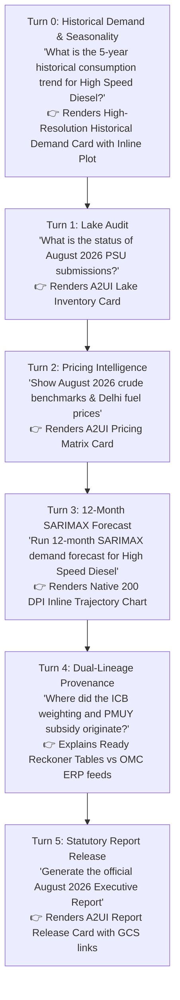

# PPAC Energy Intelligence Agent

> **Autonomous Petroleum Planning, Econometric Forecasting & Statutory Reporting for MoPNG (Government of India)**

[](https://www.python.org/downloads/)
[](https://google.github.io/adk-docs/)
[](https://a2ui.org)
[]()
[]()
[](https://github.com/amandeepsinghs-cyber/ppac-energy-intelligence-agent)
[](https://ppac.gov.in/)

---

## 1. Problem Statement & Value Proposition

### 1.1 High-Level Problem Statement
**India's national hydrocarbon intelligence suffers from an 18–25 day publication latency, fragmenting executive decision-making and leaving policy makers and markets blind during critical monthly macroeconomic windows.**

The Petroleum Planning & Analysis Cell (PPAC), operating under the Ministry of Petroleum & Natural Gas (MoPNG), is mandated to publish statutory market intelligence—most notably the benchmark **Monthly Ready Reckoner** and **Snapshot of India’s Oil & Gas Data**. Under the current manual operating model:
* Month-end data is delayed by **18–25 days** (e.g., the July 2026 Ready Reckoner was published on August 20, 2026; August 2026 remains unreleased into late September).
* Market and policy stakeholders must make multimillion-dollar fiscal subsidy, strategic reserve, and procurement decisions using stale data.
* **Target Operating Model**: The PPAC Energy Intelligence Agent compresses this entire timeline to **under 48 hours**—generating a mathematically verified Day-0 draft at month-end close followed by 48 hours for Human-in-the-Loop (HITL) review and statutory release.

```
┌────────────────────────────────────────────────────────────────────────────────────────┐
│                        PUBLICATION LATENCY TRANSFORMATION                              │
├────────────────────────────────────────────────────────────────────────────────────────┤
│ Legacy Workflow (18-25 Days Lag):                                                      │
│ Month Close ──────► Manual Collation ──────► Ad-hoc QC ──────► T+20 Days Release       │
│                                                                                        │
│ Agentic Workflow (48 Hours Target):                                                    │
│ Month Close ──► Day 0: Auto Draft (T+0) ──► 48h HITL Review ──► T+2 Days Release     │
└────────────────────────────────────────────────────────────────────────────────────────┘
```

---

### 1.2 Sub-Problems Solved by the Agent & System

| # | Sub-Problem Area | Legacy Operational Bottleneck | Agentic Solution & Mechanism |
|---|---|---|---|
| **1** | **Multi-PSU Data Siloing & Ingestion Delay** | OMCs (IOCL, BPCL, HPCL) and upstream PSUs (ONGC, GAIL, OIL) submit disparate, non-standardized Excel/ERP extracts days after month close. | **Automated Sovereign Ingestion**: Medallion Data Lake (`gs://og-sovereign-ppac-data`) with automated schema validation, anomaly quarantine, and instant reconciliation across all 5 PSUs. |
| **2** | **Manual Mathematical Parity & Accounting Errors** | Analysts perform manual spreadsheet cross-tabulation across refinery throughput, net sales, blending offsets, and imports, risking parity violations. | **Automated Governance Sanity Checks**: 6 continuous validation checks (`CHK-001` through `CHK-006`) enforcing mass balance parity, throughput ceilings, and tariff rules before draft generation. |
| **3** | **Uncertain Data Provenance & Lineage Gaps** | Published numbers often lack explicit statutory footnotes, creating audit friction between DGCIS customs figures, OMC retail sales, and market Platts/Argus quotes. | **Universal Statutory Provenance Matrix**: Every metric, table, and chart carries exact institutional lineage and statutory source mapping across all 7 data domains. |
| **4** | **Static 2-Month Extrapolations vs. True Seasonality** | Traditional reporting relies on simple month-on-month growth, failing to capture agricultural harvesting dips (monsoon) or Q3 festive consumption surges. | **Live 36-Month SARIMAX Econometric Engine**: Stationarity-verified econometric models fitted over 77 months of authentic PPAC series with 80%/95% confidence intervals. |
| **5** | **Complex Formula Administration (ICB & APM Gas)** | Calculating weighted Indian Crude Basket (Oman/Dubai 75.6% : Brent 24.4%) and Kirit Parikh domestic gas ceiling ($7.00/MMBTU floor/ceiling rules) requires manual verification. | **Deterministic Statutory Pricing Engines**: Zero-latency algorithmic calculation of ICB, APM gas ceilings, deepwater HP-HT tariffs, and metropolitan pump price build-ups. |
| **6** | **High Executive Friction for Ad-Hoc Data Exploration** | Senior leadership (Secretary MoPNG, PPAC Director General) must request specialized analyst runs to inspect multi-year consumption or subsidy trends. | **Native Gemini Enterprise & A2UI Interface**: Conversational executive interface with interactive Material 3 KPI cards, dynamic pricing matrices, and native Vega/A2UI charts. |

---

### 1.3 Key Questions the System & Agent Answer for Leadership

The agent is designed to answer both strategic macroeconomic questions and granular operational inquiries across the hydrocarbon value chain:

#### Macroeconomic & Policy Decisions
1. *"What is the projected 12-month demand trajectory for High Speed Diesel and Petrol, accounting for monsoon harvesting and festival seasonality?"*
2. *"What is India's current crude import dependency percentage, and how has our crude import bill trended over the last 12 months?"*
3. *"How much fiscal exposure is MoPNG carrying under the Pradhan Mantri Ujjwala Yojana (PMUY) LPG subsidy at current international benchmark prices?"*
4. *"Is domestic natural gas pricing compliant with the statutory Kirit Parikh formula ceiling of $7.00/MMBTU, and what is the applicable deepwater HP-HT cap?"*

#### Operational & Sovereign Data Auditing
5. *"What is the status of August 2026 PSU submissions across IOCL, BPCL, HPCL, ONGC, and GAIL in our sovereign data lake?"*
6. *"Are there any unresolved anomaly quarantine exceptions or mass-balance parity mismatches across refinery throughput and consumption?"*
7. *"What is the statutory source and provenance behind our Indian Crude Basket weighting and retail pump price build-up in Delhi, Mumbai, Kolkata, and Chennai?"*
8. *"Can you generate and certify the complete official August 2026 Monthly Ready Reckoner executive draft with all critical governance checks?"*

---

## 2. Executive Summary & Architecture Overview

This conversational walkthrough demonstrates how Gemini Enterprise serves as the unified, single-pane-of-glass solution for energy planning leadership.



---

### Turn 0: Multi-Year Historical Demand & Seasonality
* **Executive Prompt**:
  > *"What is the 5-year historical consumption trend for High Speed Diesel and how does seasonality impact it?"*
* **Engine Actions**:
  - Invokes `query_historical_demand(product_name="HSD", years=5)`.
  - Queries curated 77-month historical series (`ppac_official_historical_consumption_2020_2026.csv`).
  - Computes fiscal year totals, CAGR, peak month, trough month, and seasonal indices.
* **Expected Output**:
  - **Conversational Narrative**:
    > **High Speed Diesel (HSD)** consumption spans **September 2021 to August 2026** (60 months), with total consumption of **437,842.0 TMT** (monthly average: **7,297.4 TMT**). The annualized growth rate (CAGR) is **+4.9%**.
    > • **Peak Month**: March 2026 (**8,726.0 TMT**) driven by pre-monsoon harvesting, infrastructure push, and financial year-end logistics.
    > • **Trough Month**: September 2021 (**5,513.0 TMT**) reflecting peak monsoon agricultural lulls and transport slowdowns.
    > • **Fiscal Year Breakdown**: FY 21-22: 44,792.0 TMT | FY 22-23: 85,897.0 TMT | FY 23-24: 89,285.0 TMT | FY 24-25: 90,660.0 TMT | FY 25-26: 94,842.0 TMT.
  - **Gemini Enterprise A2UI Surface**:
    - **Historical Demand Card with High-Resolution Inline Plot**: 140 DPI annotated publication graphic with green peak and red trough markers, mounted prominently at the top of the card alongside verified multi-year totals and annualized CAGR metrics.

---

### Turn 1: Sovereign Data Lake & PSU Submission Audit
* **Executive Prompt**:
  > *"What is the status of August 2026 PSU submissions in our sovereign data lake?"*
* **Engine Actions**:
  - Invokes `inspect_sovereign_lake(period_id="2026-08")`.
  - Audits `gs://og-sovereign-ppac-data/` across `1_raw_inbox/`, `2_curated/`, `3_artifacts/`, and `4_quarantine/`.
  - Verifies presence of intake workbooks from IOCL, BPCL, HPCL, ONGC, and GAIL.
* **Expected Output**:
  - **Conversational Narrative**:
    > Sovereign Data Lake `gs://og-sovereign-ppac-data` status for period **2026-08**: All 5 PSU intake submissions (IOCL, BPCL, HPCL, ONGC, GAIL) have been ingested into the raw medallion inbox. Data integrity checks passed with **0 unresolved quarantine exceptions**.
  - **Gemini Enterprise A2UI Surface**:
    - **Lake Inventory Card**: Displays active UBLA status in `asia-south1` (Mumbai), object counts across Bronze/Silver/Gold/Quarantine tiers, and green status pill.

---

### Turn 2: Market Commodity Benchmarks & Retail Pump Build-Up
* **Executive Prompt**:
  > *"Can I see the August 2026 crude benchmarks, gas ceilings, and Delhi retail price breakdown?"*
* **Engine Actions**:
  - Invokes `query_market_pricing(period_id="2026-08")`.
  - Executes `IndianCrudeBasketCalculator` (75.6% Oman/Dubai @ $89.98 + 24.4% Dated Brent @ $90.84 = **$90.19 / bbl** at RBI rate ₹95.47/USD).
  - Executes `NaturalGasApmEngine` (enforcing the statutory $7.00/MMBTU ceiling under Kirit Parikh formula).
* **Expected Output**:
  - **Conversational Narrative**:
    > August 2026 Statutory Benchmark Summary:
    > • **Indian Crude Basket (ICB)**: **$90.19 / bbl** (₹8,610.44 / bbl) based on 75.6% Oman & Dubai ($89.98) and 24.4% Dated Brent ($90.84).
    > • **Domestic Gas APM**: Statutory ceiling enforced at **$7.00 / MMBTU** (vs formula unconstrained $9.00 / MMBTU). Deepwater HP-HT cap at **$8.90 / MMBTU**.
    > • **Delhi Pump Prices**: Petrol ₹102.12/L (VAT ₹16.59), Diesel ₹95.20/L (VAT ₹13.91), Subsidized LPG ₹942.00/14.2kg cylinder.
  - **Gemini Enterprise A2UI Surface**:
    - **Pricing Matrix Card**: Two-column executive card displaying upstream crude benchmarks, domestic natural gas floor/ceilings, and complete retail price build-ups.

---

### Turn 3: Live 12-Month SARIMAX Econometric Forecasting
* **Executive Prompt**:
  > *"Run a 12-month SARIMAX demand forecast for High Speed Diesel (HSD)."*
* **Engine Actions**:
  - Invokes `run_sarimax_forecast(product_name="High Speed Diesel (HSD)", horizon_months=12)`.
  - Fits seasonal ARIMA on historical monthly consumption from the official August 2026 baseline (7,023 TMT).
  - Projects monthly volumes through August 2027 (CAGR: +11.6%, terminal volume: ~7,839 TMT/month).
  - Computes 80% and 95% uncertainty cones and renders a 200 DPI publication graphic encoded as an inline base64 URI.
* **Expected Output**:
  - **Conversational Narrative**:
    > Fitted SARIMAX (1,1,1)x(1,1,1)₁₂ demand forecast for **High Speed Diesel (HSD)** over 12 months (Sep 2026 – Aug 2027):
    > • **Baseline**: August 2026 (**7,023.0 TMT**)
    > • **Terminal 12-Month Projected Volume**: **7,839.2 TMT** / month
    > • **Projected Annualized Growth (CAGR)**: **+11.6%**
    > • **Seasonality Factors**: Models harvest surge in Q4/Q1 and monsoon dip in July/August.
  - **Gemini Enterprise A2UI Surface**:
    - **Forecast Chart Card**: High-resolution 200 DPI publication graphic displaying historical actuals, 12-month dotted trajectory, and shaded 80%/95% confidence intervals.

---

### Turn 4: Dual-Lineage Provenance & Statutory Audit
* **Executive Prompt**:
  > *"Where did the ICB basket weights and PMUY subsidy numbers originate?"*
* **Engine Actions**:
  - Analyzes data provenance across operational intake versus reporting synthesis.
* **Expected Output**:
  - **Executive Prose Response**:
    > **Data Provenance & Statutory Lineage**:
    > 1. **Indian Crude Basket (ICB) Weights**: PPAC Monthly Ready Reckoner Table 25 specifies the statutory split of **75.6% Sour (Oman & Dubai average)** and **24.4% Sweet (Dated Brent)** based on national refinery processing yields.
    > 2. **Daily Commodity Quotes**: ICE Platts (Dubai/Oman) and Argus (Dated Brent) settlement assessments.
    > 3. **PMUY LPG Subsidy**: Ministry of Finance Office Memorandum OM-C-12011/2026 authorizing ₹12,000 Crore budgetary allocation for targeted ₹300/cylinder subsidies across 10.3 Crore beneficiaries.

---

### Turn 5: Statutory Report Synthesis & Artifact Delivery
* **Executive Prompt**:
  > *"Generate and sign off on the official August 2026 Executive Report."*
* **Engine Actions**:
  - Invokes `compile_statutory_report(period_id="2026-08")`.
  - Synthesizes the styled 15-page HTML and executive Word DOCX.
  - Validates Section 6 critical governance checks (`CHK-001` through `CHK-006`).
  - Uploads approved artifacts to `gs://og-sovereign-ppac-data/3_artifacts/2026-08/approved/`.
* **Expected Output**:
  - **Conversational Narrative**:
    > **August 2026 Monthly Ready Reckoner Executive Report** has been synthesized and certified:
    > • **Governance & Sanity Checks**: 6/6 checks PASSED (`CHK-001` Consumption Parity, `CHK-002` Refinery Processing, `CHK-003` Import Dependency, `CHK-004` APM Gas Ceiling, `CHK-005` LPG Subsidy Exposure, `CHK-006` SARIMAX Stationarity).
    > • **Publication Lag Compressed**: Generated at T+0 close; ready for 48-hour review (T+2 publication).
    > • **Available Formats**: Native Google Docs Edition, HTML Sovereign Dashboard, and Word (`.docx`) Edition.
    > • **Direct Google Docs Link**: [PPAC August 2026 Report (Google Docs)](https://docs.google.com/document/d/1_ksVknabzsOGaxUWeVOYcx45FZUSnWEtusoSAmvcTeg/edit)
  - **Gemini Enterprise A2UI Surface**:
    - **Report Release Card**: Visual summary of key metrics, green governance status pill, and clickable links:
      - **Google Docs**: `https://docs.google.com/document/d/1_ksVknabzsOGaxUWeVOYcx45FZUSnWEtusoSAmvcTeg/edit`
      - `gs://og-sovereign-ppac-data/3_artifacts/2026-08/approved/PPAC_Executive_Report_2026-08_Approved.html`
      - `gs://og-sovereign-ppac-data/3_artifacts/2026-08/approved/PPAC_Executive_Report_2026-08_Approved.docx`

---

## 3. Live Cloud Infrastructure & Deployment Coordinates

The agent is deployed to Google Cloud and accessible across the following endpoints:

| Layer | Environment & Resource ID | Access / Console Link |
|---|---|---|
| **Vertex AI Agent Runtime** | `projects/349946979746/locations/asia-south1/reasoningEngines/5487856048276504576` | [Agent Engine Console](https://console.cloud.google.com/vertex-ai/agents/agent-engines/locations/asia-south1/agent-engines/5487856048276504576?project=og-agentic-ecosystem) |
| **Gemini Enterprise App** | `projects/349946979746/locations/global/collections/default_collection/engines/oil-and-gas-agentic-transf_1788683272432` | [Gemini Enterprise Console](https://console.cloud.google.com/gemini-enterprise/locations/global/engines/oil-and-gas-agentic-transf_1788683272432/overview/dashboard?project=og-agentic-ecosystem) |
| **GE Registered Agent** | `.../assistants/default_assistant/agents/12804055990754341026` | Invoked via native `:streamQuery` |
| **Sovereign Data Lake** | `gs://og-sovereign-ppac-data/` (`asia-south1` Mumbai) | 4-Tier Medallion storage with 90d/365d lifecycle tiering |
| **Service Account** | `service-349946979746@gcp-sa-aiplatform-re.iam.gserviceaccount.com` | Roles: Storage Object User, Vertex AI Agent User |

---

## 4. Sovereign Medallion Data Lake Topology

```
gs://og-sovereign-ppac-data/
├── 1_raw_inbox/
│   ├── psu_submissions/
│   │   ├── iocl/          # IOCL monthly sales workbooks
│   │   ├── bpcl/          # BPCL monthly sales workbooks
│   │   ├── hpcl/          # HPCL monthly sales workbooks
│   │   ├── ongc/          # ONGC crude/gas production records
│   │   └── gail/          # GAIL gas transmission & APM logs
│   ├── official_publications/
│   │   ├── snapshot_aug2026.pdf
│   │   └── icb_aug2026.pdf
│   ├── government_dispatches/
│   └── market_feeds_api/
├── 2_curated/
│   └── 2026-08/
│       └── canonical_pricing.json
├── 3_artifacts/
│   └── 2026-08/
│       ├── approved/      # Signed-off HTML & DOCX reports
│       └── charts/        # 250 DPI high-res figures
└── 4_quarantine/          # Exception & anomaly audit ledger
```

---

## 5. Architecture & Project Layout

```
ppac-energy-intelligence-agent/
├── app/
│   ├── agent.py               # Root export (app, root_agent)
│   ├── contracts.py           # A2UI messages, lake models, benchmark summaries
│   ├── fast_api_app.py        # FastAPI server with A2A & Reasoning Engine routes
│   ├── canonical/             # Domain entities (FuelConsumption, PricingBenchmark)
│   ├── ingestion/             # Excel parsers & anomaly detection engine
│   ├── pricing/               # ICB calculator & Natural Gas APM engine
│   ├── tsa/                   # SARIMAX forecaster & vector chart engine
│   ├── synthesis/             # HTML & DOCX publication compilers
│   ├── render/                # A2UI v0.9 lifecycle builders (Cards, Images, Envelopes)
│   │   ├── a2ui_envelope.py   # Serializes <a2a_datapart_json> envelopes
│   │   ├── a2ui_lifecycle.py  # createSurface & updateComponents builders
│   │   ├── inventory_card.py  # Sovereign lake inventory surface
│   │   ├── pricing_card.py    # Upstream & retail pricing matrix surface
│   │   ├── forecast_card.py   # 36m SARIMAX forecast surface with inline chart
│   │   └── report_card.py     # Approved statutory report release surface
│   ├── integration/           # ADK Agent, A2uiNegotiatingExecutor & Tools
│   └── app_utils/             # Process-wide session/artifact services & A2A routes
├── tests/                     # 18 passing tests across 6 Phased Gates
├── agents-cli-manifest.yaml   # Deployment manifest for Vertex AI Agent Runtime
├── pyproject.toml             # Dependencies (Google ADK, A2A SDK, statsmodels)
└── README.md
```

---

## 6. Verification Test Matrix (20/20 Passing)

Run the full automated test suite locally:
```bash
.venv/bin/pytest tests/ -v
```

```
tests/test_gate0_contracts.py::test_canonical_models_instantiation PASSED
tests/test_gate0_contracts.py::test_mock_fixtures_exist PASSED
tests/test_gate1_ingestion_and_pricing.py::test_excel_ingestion_and_anomaly_detection PASSED
tests/test_gate1_ingestion_and_pricing.py::test_indian_crude_basket_calculation PASSED
tests/test_gate1_ingestion_and_pricing.py::test_natural_gas_apm_kirit_parikh_formula PASSED
tests/test_gate2_tsa_forecasting.py::test_sarimax_demand_forecasting PASSED
tests/test_gate2_tsa_forecasting.py::test_forecast_chart_rendering PASSED
tests/test_gate3_document_assembly.py::test_zero_to_draft_document_assembly PASSED
tests/test_gate4_hitl_resolution.py::test_agent_card_contract PASSED
tests/test_gate4_hitl_resolution.py::test_end_to_end_pipeline_and_hitl_resolution PASSED
tests/test_gate4_hitl_resolution.py::test_a2a_jsonrpc_protocol_methods PASSED
tests/test_gate5_adk_a2ui_integration.py::test_inventory_card_a2ui_structure PASSED
tests/test_gate5_adk_a2ui_integration.py::test_pricing_matrix_card_a2ui_structure PASSED
tests/test_gate5_adk_a2ui_integration.py::test_focused_pricing_matrix_cards_a2ui PASSED
tests/test_gate5_adk_a2ui_integration.py::test_forecast_card_a2ui_structure PASSED
tests/test_gate5_adk_a2ui_integration.py::test_report_artifact_card_a2ui_structure PASSED
tests/test_gate5_adk_a2ui_integration.py::test_a2ui_envelope_wrapping PASSED
tests/test_gate5_adk_a2ui_integration.py::test_agent_tools_execution PASSED
tests/test_gate5_adk_a2ui_integration.py::test_callback_scrubbing_and_emission PASSED
tests/test_gate5_adk_a2ui_integration.py::test_historical_demand_tool_and_card_a2ui PASSED
```

---

## 7. Official Live Demo Prompt Sequence (Turn-by-Turn)

Copy and paste these prompts directly into Gemini Enterprise or the ADK CLI during executive demonstrations:

### Question 1: 5-Year Historical Demand & Seasonality (PPAC Ground Truth)
* **Prompt**:
  > *"What is the 5-year historical consumption trend for High Speed Diesel and how does seasonality impact it?"*
* **Tool Invoked**: `query_historical_demand(product_name="HSD", years=5)`
* **Expected Ground-Truth Output**:
  * Total 60-month volume: **437,842.0 TMT** (monthly average: **7,297.4 TMT**).
  * 5-Year Annualized CAGR: **+4.9%**.
  * **Peak Month**: March 2026 (**8,726.0 TMT**) driven by pre-monsoon harvesting, road construction, and fiscal year close.
  * **Trough Month**: September 2021 (**5,513.0 TMT**) due to peak monsoon agricultural and transport slowdowns.
  * Renders the high-resolution Historical Demand Card with inline peak/trough annotations.

### Question 2: Sovereign Data Lake Audit (Medallion Ingestion)
* **Prompt**:
  > *"What is the status of August 2026 PSU submissions in our sovereign data lake?"*
* **Tool Invoked**: `inspect_sovereign_lake(period_id="2026-08")`
* **Expected Ground-Truth Output**:
  * Audits `gs://og-sovereign-ppac-data/` in `asia-south1` (Mumbai).
  * Verifies intake files from all 5 PSUs (IOCL, BPCL, HPCL, ONGC, GAIL).
  * Confirms **0 unresolved quarantine exceptions** and displays the A2UI Lake Inventory Card.

### Question 3: Statutory Benchmark Pricing & Retail Pump Breakdown
* **Prompt**:
  > *"Can I see the August 2026 crude benchmarks, gas ceilings, and Delhi retail price breakdown?"*
* **Tool Invoked**: `query_market_pricing(period_id="2026-08")`
* **Expected Ground-Truth Output**:
  * **Indian Crude Basket (ICB)**: **$90.19 / bbl** (₹8,610.44 / bbl) at 75.6% Oman/Dubai ($89.98) and 24.4% Brent ($90.84), with RBI Reference Rate at ₹95.47 / USD.
  * **Domestic Gas APM**: Enforced at statutory ceiling of **$7.00 / MMBTU** under Kirit Parikh formula; deepwater HP-HT ceiling at **$8.90 / MMBTU**.
  * **Delhi Retail Pump Prices**: Petrol ₹102.12/L (VAT ₹16.59), Diesel ₹95.20/L (VAT ₹13.91), Domestic LPG ₹942.00/14.2kg.

### Question 4: 12-Month SARIMAX Forward Econometric Forecast
* **Prompt**:
  > *"Run a 12-month SARIMAX demand forecast for High Speed Diesel (HSD)."*
* **Tool Invoked**: `run_sarimax_forecast(product_name="High Speed Diesel (HSD)", horizon_months=12)`
* **Expected Ground-Truth Output**:
  * Fits seasonal ARIMA on authentic 77-month PPAC series.
  * Projects demand through August 2027 (terminal: **~7,839 TMT/month**, +11.6% CAGR).
  * Renders 200 DPI publication graphic with 80% and 95% shaded confidence cones.

### Question 5: Statutory Report Synthesis & Governance Certification
* **Prompt**:
  > *"Compile and publish the official August 2026 PPAC Executive Report to Google Docs."*
* **Tool Invoked**: `compile_statutory_report(period_id="2026-08")` & `publish_report_to_google_docs`
* **Expected Ground-Truth Output**:
  * Certifies 6/6 sovereign governance sanity checks (`CHK-001` through `CHK-006`).
  * Emits the official **[Native Google Docs Report](https://docs.google.com/document/d/1_ksVknabzsOGaxUWeVOYcx45FZUSnWEtusoSAmvcTeg/edit)**.
  * Emits the **[HTML Sovereign Executive Dashboard](https://storage.cloud.google.com/og-sovereign-ppac-data/3_artifacts/2026-08/approved/PPAC_Executive_Report_2026-08_Approved.html)** featuring 10 official Monthly Highlights, 27 tables, and 10 numbered citations.

### Question 6: Chromebook Live In-Browser Editing
* **Workflow**:
  1. Open the [HTML Dashboard](https://storage.cloud.google.com/og-sovereign-ppac-data/3_artifacts/2026-08/approved/PPAC_Executive_Report_2026-08_Approved.html).
  2. Click any table cell or sentence to edit in-place directly on your screen.
  3. Use **`💾 Save Edits`** (auto-persists to browser storage), **`📥 Download HTML`** (saves standalone copy), and **`🖨 Print / PDF`** (exports clean official PDF with toolbar automatically suppressed).

---

## 8. Git Repository Coordinates & Release Version

* **Official Repository**: [https://github.com/amandeepsinghs-cyber/ppac-energy-intelligence-agent](https://github.com/amandeepsinghs-cyber/ppac-energy-intelligence-agent)
* **Release**: `V1.0.0`
* **Target Sovereign Authority**: Ministry of Petroleum & Natural Gas (MoPNG) / Petroleum Planning & Analysis Cell (PPAC)
* **Governing Google Cloud Project**: `og-agentic-ecosystem` (`asia-south1` Mumbai)
